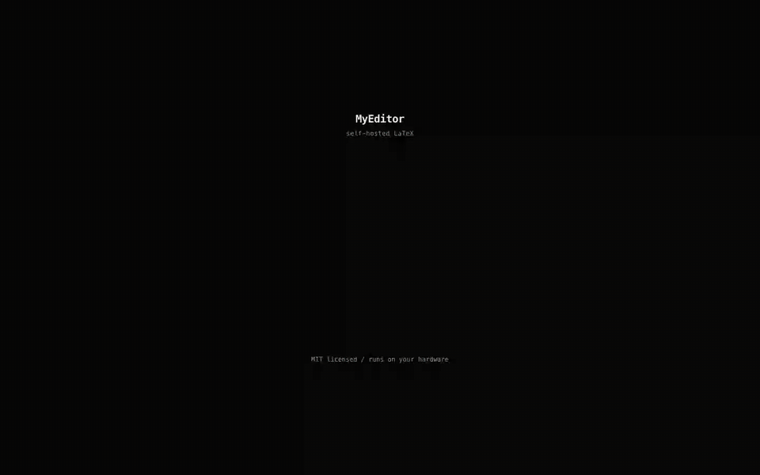

<h1 align="center">MyEditor</h1>
<p align="center"><strong>Overleaf, on your own Mac.</strong></p>
<p align="center">Write LaTeX, watch the PDF rebuild next to it, and let the AI you already pay for edit the source.</p>

<p align="center">
  <a href="https://github.com/rishirochan/MyEditor/releases/latest/download/MyEditor-1.0.0-arm64.dmg"><strong>Download for macOS (Apple Silicon)</strong></a>
</p>

<p align="center">
  <a href="docs/demo.mp4"></a>
</p>
<p align="center"><sub>45 seconds, start to finish. Click for the full-quality MP4.</sub></p>

<p align="center">
  
  
</p>

## What it does

The video above is the whole loop. You type a name, pick the Resume template,
and get a compiled PDF. Then you ask the assistant to make the experience
bullets lead with numbers. It edits `main.tex`, shows you the diff, and the PDF
rebuilds with the new lines.

**Edit and preview side by side.** The editor sits on the left and the PDF on
the right. With auto-compile on, the PDF rebuilds after you stop typing. A
resume builds in under a second, and a long thesis takes as long as `latexmk`
needs.

**An assistant that edits the file.** Point it at up to two files, or
highlight a passage, and describe the change. It writes the edit into the
`.tex` source and shows a red and green diff. One button undoes the whole edit.
Contour mode only discusses and never touches your files. Carve mode is allowed
to edit.

**It runs on a subscription you already have.** If the `claude` or `codex` CLI
is logged in on your Mac, MyEditor uses it. You don't need an API key and you
don't get a per-token bill. If you'd rather use an OpenAI, Anthropic,
OpenRouter or custom endpoint key, that works too.

**Build errors you can click.** MyEditor parses the log into errors and
warnings. Clicking one opens the file at that line. When a build fails, the
assistant can read the log, make the smallest fix, and queue another build.

**Templates to start from.** Resume (based on
[Jake's Resume](https://github.com/jakegut/resume)), Article, Thesis, Beamer,
Letter, and Blank.

**Sharing.** Invite someone by email as an editor or viewer, with an optional
expiry, or turn on a public link. You can revoke the link later, and every
copy of it stops working.

**A REST API.** Create API keys in the app, then compile a `.tex` file to PDF
from a script, manage projects and files, or download builds. The endpoint list
is in [DOCS.md](DOCS.md#-rest-api).

**Everything stays on your Mac.** Projects, PDFs and the database live in
`~/Library/Application Support/MyEditor`. Builds run with shell escape off and
a time limit. There's no account, no password and no telemetry.

## Install

1. Download the
   [DMG](https://github.com/rishirochan/MyEditor/releases/latest/download/MyEditor-1.0.0-arm64.dmg)
   and drag MyEditor to Applications. The app isn't signed yet, so the first
   time you open it, right-click it and choose **Open**.
2. The first launch asks for your name and sets up LaTeX on its own. If MacTeX
   or another TeX Live is on your `PATH`, MyEditor uses it. Otherwise it
   downloads [TinyTeX](https://yihui.org/tinytex/) (about 210 MB) into
   `~/Library/TinyTeX`, which doesn't need an admin password. When a document
   needs a package TinyTeX lacks, the build installs it and retries.
3. To use the assistant, log in to a CLI in your terminal (`claude` or
   `codex login`), then pick it in the AI tab.

## When it breaks

**Builds fail with "LaTeX is not installed yet".** The first-launch download
didn't finish. Restart MyEditor and setup picks up where it stopped. If it
fails again, the welcome screen shows the reason. It's usually the internet
connection.

**A build says a package was not found.** MyEditor only installs missing
packages into TinyTeX. With MacTeX, run `sudo tlmgr install <package>`
yourself.

**The AI tab says the CLI isn't installed or logged in.** Run
`claude auth status` or `codex login status` in a terminal, then restart
MyEditor so it reads your shell's `PATH` again.

**The app shows an error on start.** Check
`~/Library/Application Support/MyEditor/server.log`. If a crash left the
database locked, quitting and reopening usually clears it.

## Coming soon

**The assistant checks its own work.** Today an AI edit counts as done when the
document compiles. A figure can still run off the page. The plan is to render
the changed page and have the model compare it with what you asked for.

**Edit from a screenshot.** Point at a rendered page, say "number this
equation" or "pull the caption closer", and get the change back as LaTeX.

**Branches for documents.** Let the assistant rewrite a chapter on a branch,
compile both versions, and compare them side by side before anything touches
your main draft. Undo is enough for a paragraph. It's the wrong tool for a
rewrite.

Opinions on any of these are welcome in the issues.

## Development

```bash
pnpm install
pnpm db             # terminal 1: Postgres on :5432 (data in .pg-dev/), prints the DATABASE_URL
pnpm dev            # terminal 2: web app on :3000, socket server on :3001
pnpm desktop        # build and run the Electron app against your real app data
pnpm desktop:dist   # build the DMG into apps/desktop/dist
```

Put the printed `DATABASE_URL` and a `SESSION_SECRET` in `apps/web/.env`. The
server runs migrations when it starts.

Everything runs in one Node process. The Next.js server starts the compile
queue and the Socket.IO server from `src/instrumentation.ts`. The Electron
shell in `apps/desktop` starts Postgres, picks free ports, and runs that
server.

Product intent is in [PRODUCT.md](PRODUCT.md), design tokens in
[DESIGN.md](DESIGN.md).

## License

[MIT](LICENSE). Fork it, host it, sell it, no strings.
